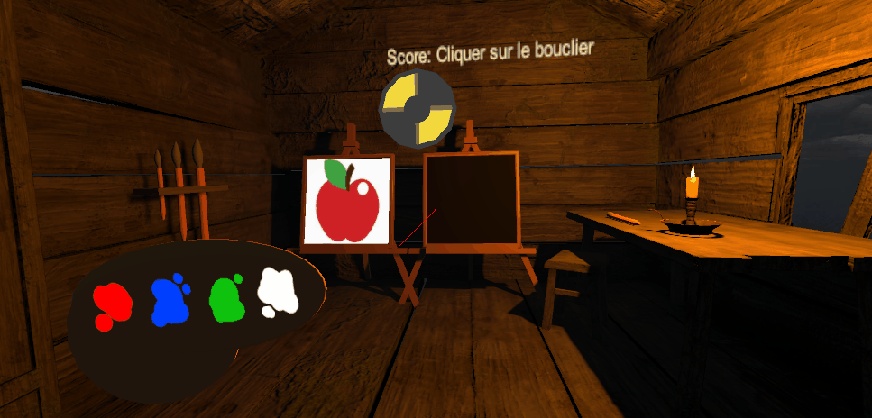
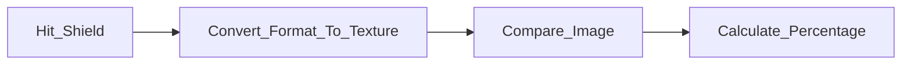
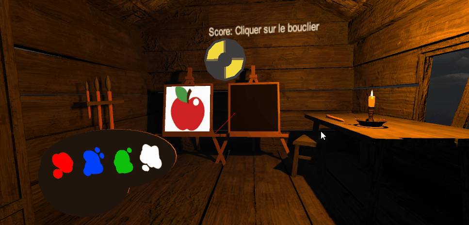

# Projet de peinture en VR - Unity

Ce projet est effectué dans le cadre du projet de dernière année pour le module de vision et réalité augmentée. Il s'agit d'une expérience immersive de peinture en réalité virtuelle. Les joueurs peuvent se téléporter dans un atelier virtuel et utiliser différents outils pour peindre des œuvres d'art numériques. 

*Le rendu de ce projet est prévu pour le 20/03/2023.*

# Sommaire des fonctionnalités
- [Les différents outils disponible](#les-différents-outils-disponible)
- [Gestion de la sélection des outils](#gestion-de-la-sélection-des-outils)
- [Mini-jeu](#mini-jeu)
- [Fonctionnalité supplementaire](#fonctionnalité-supplementaire)

## Les différents outils disponible
[*(Back to top)*](#sommaire-des-fonctionnalités)

| Démonstration | Explication |
|---------|---------|
|  | **3 Interactions de peinture différentes** : Pinceau + Spray + Baguette magique |
|  | **Une palette mobile de 4 couleur** : elle est attachée à la main gauche du joueur pour bouger en même temps que ce dernier|

## Gestion de la sélection des outils
[*(Back to top)*](#sommaire-des-fonctionnalités)

| Démonstration | Explication |
|---------|---------|
|  | **Gestion chute outil** : pour ajouter plus de confort de jeu, si l'utilisateur lâche son pinceau celui-ci revient automatiquement à sa place initiale (sur la table), cela est possible grâce au script "StoreTool" qui hérite de "XRGrabInteractable"|

## Mini-jeu
[*(Back to top)*](#sommaire-des-fonctionnalités)

Le mini-jeu permet de reproduire le dessin d'un tableau et d'obtenir un score de ressemblance. Pour obtenir ce score, le programme va comparer les 2 textures en calculant la différence de chaque canal de couleur (R, V, B et Alpha) pour chaque pixel, puis en calculant la moyenne de toutes les différences. 

**Fonctionnement général :**

| Démonstration | Explication |
|---------|---------|
|  | **Téléportation** : Sélectionner le rocher magique pour vous téléporter dans l'atelier, ou l'armoire magique pour retourner dans le monde de base.|
|  | **Taille du pinceau** : Peinture, possibilité de changer la taille (avec les pinceau accroché au mur à gauche).|
|  | **Score** : Dessiner une pomme puis sélectionner le bouclier magique pour obtenir votre score de ressemblance en pourcentage. |

## Fonctionnalité supplementaire 
[*(Back to top)*](#sommaire-des-fonctionnalités)

| Démonstration | Explication |
|---------|---------|
|  | **Renard** : Parce que c'est trop mignon !! Regardez le faire ces petites roulades.|

## Groupe

* [Sebila Doubaeva](https://github.com/taredalen)
* [Camille Bayon de Noyer](https://github.com/Kamomille)
* [Maelle Marcelin](https://github.com/maaelle)
* [Monia Moghraoui](https://github.com/SoniaMogh)

## Asset Store

* [Renard](https://assetstore.unity.com/packages/3d/characters/animals/toon-fox-183005)
* [Papillon](https://assetstore.unity.com/packages/3d/characters/animals/insects/butterfly-animated-58355)
* [Atelier du mini jeu](https://assetstore.unity.com/packages/3d/environments/cabin-environment-98014)
* [Village principal](https://assetstore.unity.com/packages/3d/environments/landscapes/rpg-poly-pack-lite-148410)
* [Table pour poser les outils](https://assetstore.unity.com/packages/3d/props/wooden-pbr-table-112005)

[*(Back to top)*](#sommaire-des-fonctionnalités)

